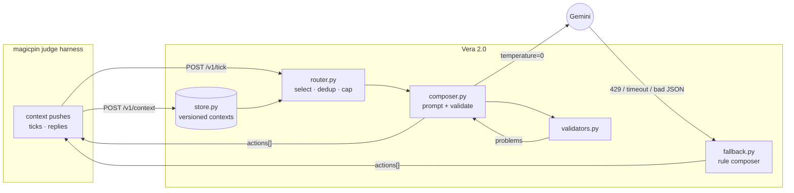
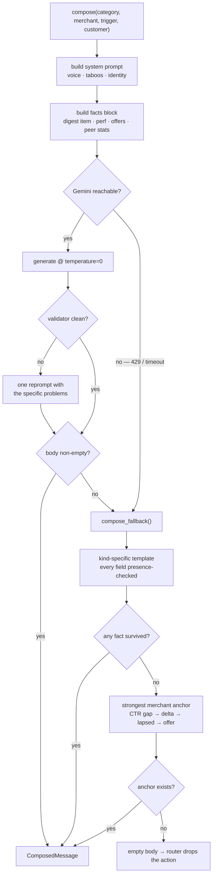
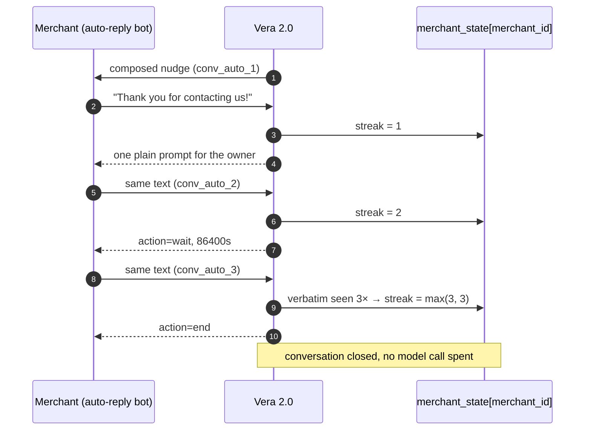

# 🤝 Vera 2.0 — The Merchant AI That Knows When To Shut Up

> A stateful WhatsApp bot that composes merchant-grade messages for India's local commerce — and **degrades to grounded, rule-composed messages the instant the LLM dies** instead of dropping the turn. Every number it says is traceable to a context it was pushed. It never invents a citation. It knows when to stop talking.

<p align="center">
  
  
  
  
  
  
</p>

---

## Table of Contents

- [Why This Bot Stands Out](#-why-this-bot-stands-out)
- [Features at a Glance](#-features-at-a-glance)
- [Tech Stack](#-tech-stack)
- [Quick Start](#quick-start)
- [Architecture Deep-Dive](#architecture-deep-dive)
  - [The Composition Pipeline](#the-composition-pipeline)
  - [The Two-Path Composer](#the-two-path-composer)
  - [Conversation State & The Auto-Reply Problem](#conversation-state--the-auto-reply-problem)
- [Features in Detail](#features-in-detail)
- [The Grounding Contract](#the-grounding-contract)
- [Technical Challenges & Solutions](#technical-challenges--solutions)
- [Edge Cases Handled](#edge-cases-handled)
- [Endpoints](#endpoints)
- [Project Structure](#project-structure)
- [Deployment](#deployment)
- [Known Limitations](#known-limitations)
- [License](#-license)

---

## 🏆 Why This Bot Stands Out

| Dimension | What I Built |
| --- | --- |
| **Survives quota death** | Every LLM call is wrapped. On 429, timeout, or unparseable JSON the bot composes from a deterministic rule engine covering all 25 trigger kinds — a valid, grounded message instead of a dropped turn |
| **Structurally cannot hallucinate** | The fallback reads every fact through a presence check. If a number isn't in the pushed context, the sentence carrying it is *dropped*, not filled in. Verified: zero ungrounded numbers across all 25 triggers |
| **Auto-reply detection that actually fires** | Streak is keyed on the **merchant**, not the conversation — canned replies arriving under fresh conversation ids still get caught. A verbatim inbound seen 3× is a machine even if it matches no phrase list |
| **Deadline-bounded ticks** | Compositions run on a long-lived thread pool with a 24s budget against the judge's 30s cut. Stragglers are abandoned, never awaited |
| **Per-turn language detection** | A merchant switching English ↔ Hinglish mid-thread gets mirrored on the turn it happens, not on the profile default |
| **Knows when to stop** | Opt-out ends. Auto-reply escalates nudge → 24h wait → end. Three unanswered nudges retires the conversation. Restraint is a feature |

---

## ✨ Features at a Glance

| Feature | Description |
| --- | --- |
| **4-context composer** | Category, Merchant, Trigger, and optional Customer fold into one grounded prompt |
| **Trigger-kind routing** | 24 hand-tuned framing variants dispatch on `trigger.kind`; unknown kinds fall to a generic frame |
| **Deterministic fallback** | All 24 distinct trigger kinds rule-composed, merchant- and customer-facing, when the model is unreachable |
| **Post-LLM validation** | URL ban, CTA vocabulary, language match, anti-repetition — on **both** the compose and reply paths |
| **Multi-turn replies** | `send` / `wait` / `end` with rule fast-paths for opt-out, auto-reply, and intent transitions |
| **Customer-facing sends** | Customer-scoped triggers compose as `merchant_on_behalf` with slot offers from the trigger payload |
| **Versioned context store** | Idempotent on `(scope, id, version)`; higher versions replace atomically; same version is a no-op |
| **Suppression + dedup** | Suppression keys, per-merchant action caps, and verbatim anti-repeat guard against spam penalties |

---

## 🛠 Tech Stack

| Layer | Technology | Why |
| --- | --- | --- |
| Web framework | **FastAPI 0.115** | Pydantic-validated request/response models, ASGI, trivial OpenAPI |
| Validation | **Pydantic 2.9** | `Literal` types make the CTA vocabulary and `send_as` unrepresentable-if-wrong |
| LLM | **Gemini 2.5 Flash** → `flash-lite` fallback | `temperature=0` for the determinism the brief requires; JSON response mime type |
| Concurrency | **`concurrent.futures` thread pool** | Parallel composition under a wall-clock deadline |
| State | **In-memory dicts** | The test window forbids restarts; a database would be ceremony |
| Container | **`python:3.11-slim`** | Non-root user, cached dependency layer, stdlib healthcheck |

> **No vector DB. No retrieval framework. No agent library.** Digest retrieval is an id lookup, because the trigger already tells you which item it means.

---

## Quick Start

### Prerequisites

- **Python** ≥ 3.11
- A **Gemini API key** (the bot runs without one — it just serves fallback compositions)

### Installation & Run

```bash
pip install -r requirements.txt
cp .env.example .env      # set GEMINI_API_KEY
python app.py             # serves on $PORT (default 8080)
```

Verify it's alive:

```bash
curl -s http://localhost:8080/v1/healthz
```

### Docker

```bash
docker build -t vera-bot .
docker run --rm -p 8080:8080 --env-file .env vera-bot
```

Honors `$PORT` (Render, Fly, and Cloud Run each inject their own), runs as a non-root user, and healthchecks `/v1/healthz`.

### Against the judge

```bash
export BOT_URL=http://localhost:8080
python judge_simulator.py
```

---

## Architecture Deep-Dive

### The Composition Pipeline

The judge pushes context over time and the bot decides, on each tick, whether anything is worth saying. Nothing is fetched; everything is pushed.



### The Two-Path Composer

Every composition has two ways to succeed and no way to crash.



The last branch is the point. **A message that says less beats one that invents.** When there is genuinely nothing verifiable to say, the bot says nothing and the action is dropped — the brief rewards restraint and penalizes fabrication at −2 per instance.

### Conversation State & The Auto-Reply Problem

Production Vera burns 2–3 turns on every WhatsApp Business auto-reply. The judge tests this by sending the same canned text four times — **each under a fresh `conversation_id`**.



Keying the streak on `conversation_id` — the obvious implementation — never accumulates, and the bot nudges forever. Keying it on `merchant_id` catches it on turn 3. A verbatim repeat short-circuits the escalation entirely: a machine that has said the same sentence three times does not need a fourth chance to prove it.

---

## Features in Detail

### 1. Trigger-kind routing

`prompts/variants.py` maps each of 24 trigger kinds to a framing sentence and a suggested CTA shape. `research_digest` leads with the headline stat and cites the source; `perf_dip` names the metric, window, and percentage; `renewal_due` states days remaining and offers a confirm/cancel. Unknown kinds inherit a generic frame rather than failing.

### 2. Grounded prompt assembly

`composer._facts_block` walks the four contexts and emits only what's present: the digest item resolved by `trigger.payload.top_item_id`, the merchant's `performance` and active `offers`, the category `peer_stats` and `offer_catalog`, the customer's `relationship` and `preferences`. The system prompt injects category voice, allowed vocabulary, and banned words.

### 3. Post-LLM validation, both paths

A draft is rejected for an empty body, a URL, a CTA outside the vocabulary, or Devanagari script sent to an English-only merchant. On rejection the model is reprompted **once** with the specific problems — never in an unbounded loop. The reply path enforces the same rules plus an anti-repeat check against everything already sent in that conversation.

### 4. Deterministic reply fast-paths

Opt-out and auto-reply resolve without a model call at all. Intent transitions (`"ok lets do it"`, `"go ahead"`, `"judrna hai"`) switch the frame from qualifying to acting — the brief calls out re-qualifying after commitment as production Vera's signature failure.

### 5. Customer-facing composition

Triggers with `scope: "customer"` compose as `send_as: "merchant_on_behalf"`, address the customer by name, and offer real slots from `payload.available_slots` with a `multi_choice_slot` CTA. Five of the twenty-five seed triggers are customer-scoped.

### 6. Restraint mechanics

Suppression keys prevent re-sending the same trigger. One action per merchant per tick. Twenty actions per tick, hard cap. Three unanswered nudges retires a conversation. An empty `actions: []` is a legitimate, and sometimes correct, answer.

---

## The Grounding Contract

Every number in a fallback-composed message must appear in the contexts that produced it. This is tested, not asserted:

```python
# for each of the 25 seed triggers, with the model forced to raise:
ctx_nums = numbers(json.dumps([category, merchant, trigger, customer]))
for n in numbers(composed_body):
    assert n in ctx_nums or is_derived(n, ctx_nums)   # percent-scaling, integer diffs
```

Result: **zero ungrounded numbers, zero contract violations** — no URLs, all CTAs in vocabulary, `send_as` correct on all 5 customer-scoped triggers, suppression keys preserved.

The failure mode this guards against is specific and costly. A rule composer is *tempting* to write with facts baked into the templates — `"DCI circular: max dose 1.5→1.0 mSv"`, `"3 of your peers are attending"`, `"verified listings get 30% more clicks"`. Every one of those is a −2 fabrication penalty the moment the context says something different. Here, `1.5 → 1.0` appears only if `payload` carries it.

---

## Technical Challenges & Solutions

### 1. Auto-reply detection that never fired

**Problem:** The streak counter lived on the conversation record. The judge sends each canned reply under a new `conversation_id`, so the count was always 1, the bot sent its "looks like an auto-reply" nudge four times, and the scenario failed with *"Bot never ended after 4 auto-replies."*

**Solution:** Move the streak to `store.merchant_state[merchant_id]`, which survives conversation churn. Add a verbatim-repeat detector — an identical normalized inbound seen 3× is a machine regardless of phrasing — and let the streak absorb the repeat count (`max(streak + 1, verbatim_count)`) so the bot exits on the third turn instead of spending a nudge and a 24h wait relearning what it already knows.

### 2. `wait` responses crashing the judge

**Problem:** When composition threw, `/v1/reply` returned `{"action": "wait", "body": null}`. Spec-legal — §2.3 shows exactly that shape. But the judge calls `.lower()` on the body unconditionally, so the run died with `'NoneType' object has no attribute 'lower'`, masking the real error underneath.

**Solution:** Two fixes, because either alone is insufficient. `response_model_exclude_none=True` omits null fields, so `.get("body", "")` yields `""` rather than `None`. And the reply path no longer *reaches* a bare `wait` on model failure — it falls back to a rule-composed reply that actually advances the conversation.

### 3. The tick budget vs. the thread pool

**Problem:** Composing five triggers serially, each with a possible reprompt and retry sleeps, blows the judge's 30s timeout — `−1 per timeout`, actions dropped. The obvious fix, a `with ThreadPoolExecutor(...)` block, is worse: exiting the context manager calls `shutdown(wait=True)`, which blocks on exactly the stragglers you meant to abandon.

**Solution:** A module-level pool, `wait(futures, timeout=deadline - now)`, and results collected in trigger order (which is urgency order). Unfinished futures are cancelled if unstarted and abandoned if running. Twenty-five triggers at one second each return ten actions in two seconds.

### 4. Idempotent context pushes returning 409

**Problem:** `store.push` rejected `version <= existing`. But the spec says re-posting the *same* version is a **no-op**, and only a *lower* version is stale. The judge's `full_evaluation` re-pushes the five warmup merchants at v1 and collected five spurious conflicts.

**Solution:** Split the comparison. `version == existing` returns `200 accepted:true` with the original `stored_at`; `version < existing` returns `409 stale_version` with `current_version`.

### 5. The free tier is 20 requests/day, per model

**Problem:** Not per minute — per *day*. `gemini-2.5-flash` exhausts, `_generate` falls through to `gemini-2.5-flash-lite`, which has its own separate 20 and exhausts too. The `retryDelay: 12s` in the error body is a backoff hint, not the reset. Composition then raised, `/v1/tick` silently returned no actions, and `/v1/reply` returned the `body: null` that crashed the judge.

**Solution:** `fallback.py`. A 429 now degrades to a grounded rule-composed message rather than a dropped turn. The bot scores lower on a dead quota; it does not score zero.

---

## Edge Cases Handled

| Edge Case | Handling |
| --- | --- |
| LLM returns unparseable JSON | Braces extracted from the raw text; on failure, rule composer |
| LLM returns an empty body | Treated as failure; rule composer |
| No verifiable fact in any context | Empty body → router drops the action rather than pad it |
| Merchant is English-only | Devanagari in the draft triggers a reprompt |
| Merchant switches language mid-thread | Detected per turn from the inbound message, not the profile |
| Same canned reply, fresh conversation ids | Streak keyed on merchant; caught on turn 3 |
| Verbatim repeat with no known phrase | 3 identical inbounds ⇒ auto-reply |
| Merchant commits ("ok lets do it") | Frame switches to action; no re-qualification |
| Trigger fires for an unknown merchant | Action skipped, tick continues |
| Same context version re-pushed | `200` no-op; lower version `409` |
| Unknown `scope` on a context push | `400 invalid_scope`, not Pydantic's `422` |
| Model exceeds the tick deadline | Future abandoned; remaining actions still returned |
| Three unanswered nudges | Conversation retired |
| Bot has nothing worth saying | `{"actions": []}` |

---

## Endpoints

| Method | Path | Job |
| --- | --- | --- |
| `GET` | `/v1/healthz` | Liveness + loaded-context counts |
| `GET` | `/v1/metadata` | Team, model, approach |
| `POST` | `/v1/context` | Store/replace context, idempotent on `(scope, id, version)` |
| `POST` | `/v1/tick` | Inspect state, decide proactive sends |
| `POST` | `/v1/reply` | Merchant replied; returns `send` / `wait` / `end` |
| `POST` | `/v1/teardown` | Wipe all state at end of test |

---

## Project Structure

```
Project/
├── app.py                  # FastAPI server, 6 endpoints, deadline-bounded tick
├── router.py               # Trigger selection, urgency sort, per-merchant + 20-action caps
├── composer.py             # Prompt assembly, Gemini call, validate-and-reprompt, fallback handoff
├── fallback.py             # Deterministic rule composer — all 24 kinds, zero invented facts
├── conversation.py         # Reply routing: opt-out, auto-reply streak, intent, language-per-turn
├── validators.py           # URL ban, CTA vocabulary, language match, anti-repetition
├── store.py                # Versioned context store, merchant state, suppression, teardown
├── models.py               # Pydantic request/response contracts
├── config.py               # Env-driven model + team metadata
├── prompts/
│   ├── system.py           # Persona, hard rules, category voice, merchant identity
│   └── variants.py         # 24 trigger-kind framings + suggested CTA shapes
├── bot.py                  # Offline `compose()` entry point required by the brief
├── conversation_handlers.py# Offline `respond()` entry point (multi-turn tiebreaker)
├── gen_submission.py       # Builds submission.jsonl — 30 test_id-keyed pairs
├── smoke_test.py           # Hits a running bot end-to-end
├── Dockerfile              # slim 3.11, non-root, stdlib healthcheck
└── render.yaml             # Blueprint deploy, healthCheckPath=/v1/healthz
```

---

## Deployment

Any host that gives a public URL over HTTP works. `render.yaml` is a ready Blueprint:

1. Push to GitHub, then **New → Blueprint** on Render.
2. Set `GEMINI_API_KEY` when prompted (it's `sync: false`, never committed).
3. Verify `/v1/healthz`, `/v1/metadata`, and that `/v1/tick` with no triggers returns `{"actions": []}`.

> ⚠️ **Render's free tier spins down after ~15 minutes idle**, and a cold start takes 30–60s. The judge polls `/v1/healthz` every 60s and **disqualifies after 3 consecutive failures**, with a 30s per-call timeout. For a timed run, use a paid instance — or tunnel to localhost with `ngrok http 8080`, which the testing brief explicitly permits.

---

## Known Limitations

- **State is in-memory.** Fast and restart-free for a 60-minute window; nothing survives a process restart. Deliberate.
- **Suppression keys ignore context version.** If Phase 3 pushes a fresh digest carrying an already-seen `suppression_key`, the bot will skip it — and Phase 3 explicitly scores incorporating new context. Keying on `(suppression_key, version)` is the fix.
- **Fallback compositions are English-only.** The rule composer doesn't code-mix, so a Hinglish-preferring merchant gets plain English when the LLM is down. Correct but not ideal.
- **URLs are banned outright**, though the brief allows them "when they add clear value." A self-imposed constraint, and one engagement lever left on the table.
- **The Docker image is unbuilt.** Written against `runtime.txt`, never run — `docker build` before relying on it.

---

## 📄 License

Built for the magicpin AI Challenge 2026. Educational and demonstration purposes.
